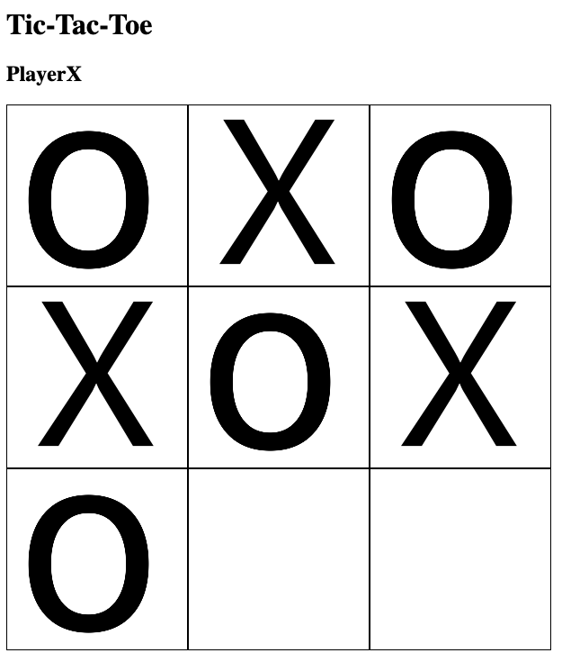

# Tic-Tac-Toe

## Description
This is a game of the infamous Tic-Tac-Toe. One player is X, the other one is O and the goal of the game is to get three of your letter in a row. A player can either win by getting three in a row vertically, horizontally, or diagonally. If neither player achives three in a row then it is a tie. If someone has won the game then the page will let you know who won. Once the game has been played you must refresh the page to start a new game.


[Tic-Tac-Toe Game Board]

## Steps to install on local computer
1. Go to [repo](https://github.com/SEI-ATL/tic-tac-toe) on Github profile
2. `Fork` and `clone` repo
3. Clone to local machine
```text
git clone https://github.com/SEI-ATL/tic-tac-toe
```
4. Go to `tic-tac-toe` directory
5. Open `index.html` in browser
```text
open index.html
```

## Explanation of key code

```javascript 
// A function that makes an array for the boxes and switches between the players
   function clickResult(e) {
        const boxArray = Array.from(boxes)
        const index = boxArray.indexOf(e.target)
        displayPlayer.innerHTML = currentPlayer

        if (currentPlayer === 'PlayerO') {
            boxes[index].classList.add('PlayerX')
            boxes[index].innerText = currentPlayer
            currentPlayer = 'PlayerX'
        } else {
            boxes[index].classList.add('PlayerO')
            boxes[index].innerText = currentPlayer
            currentPlayer = 'PlayerO'
        }
```

```css
/* This is the styling of the Tic-Tac-Toe board */
.container {
  display: grid;
  grid-template-columns: repeat(3, auto);
  width: 500px;
  height: 500px;
}
.cell {
  border: 1px solid black;
  width: 200px;
  height: 200px;
  color: white;
```

```html
<!-- This is the Tic-Tac-Toe board setup -->
<h1>Tic-Tac-Toe</h1>
  <h2 id="player">PlayerO</h2>
    <div class="container">
      <div class="cell"></div>
      <div class="cell"></div>
      <div class="cell"></div>
      <div class="cell"></div>
      <div class="cell"></div>
      <div class="cell"></div>
      <div class="cell"></div>
      <div class="cell"></div>
      <div class="cell"></div>
    </div>
```

## Support
If you have any questions, comments, or concerns my email is jaxon_narramore@hotmail.com